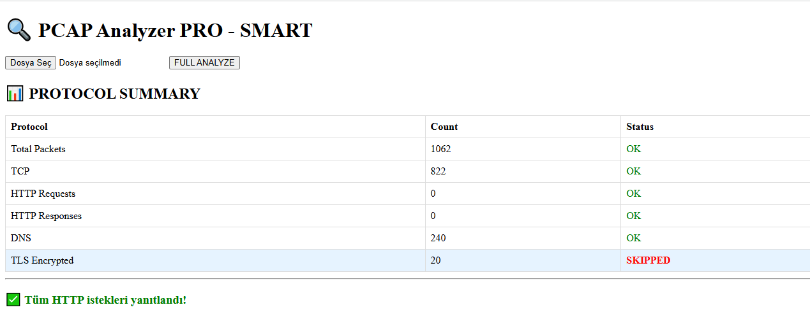
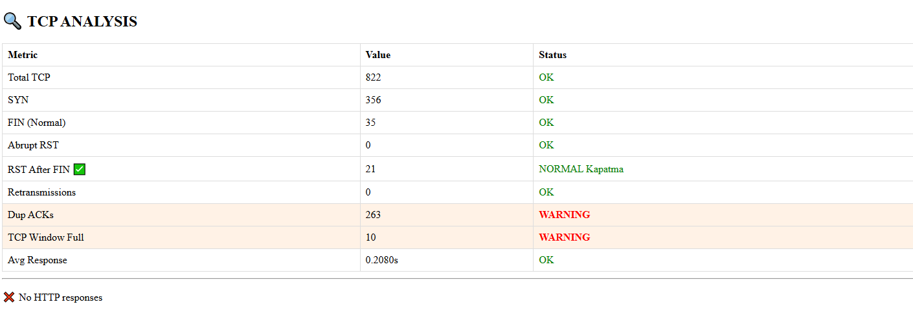
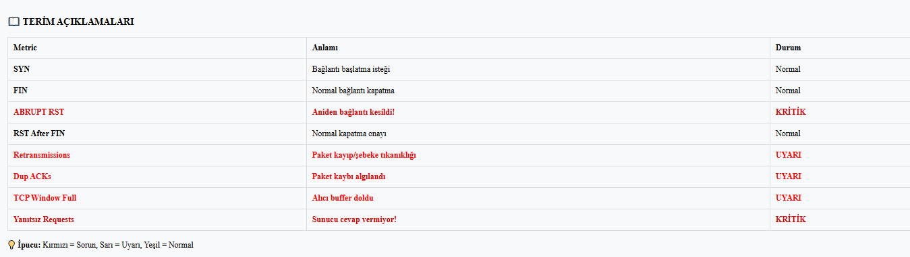

# PCAP Analyzer PRO

Welcome to **PCAP Analyzer PRO**, a powerful and open-source network traffic analysis tool built with Python, Flask, and Scapy. This application allows users to upload PCAP files, analyze network protocols (TCP, HTTP, DNS, etc.), detect anomalies, and generate detailed reports. It is designed for network administrators, security researchers, and developers who need an efficient way to inspect packet captures.

## Features

- **Comprehensive Protocol Analysis**: Analyze TCP, HTTP, DNS, and TLS traffic.
- **Anomaly Detection**: Identify unanswered HTTP requests, failed DNS queries, and RFC violations.
- **Detailed Reporting**: Generate HTML-based visual reports and downloadable TXT summaries.
- **Expert Insights**: Highlight critical issues like abrupt RSTs, retransmissions, and zero-window conditions.
- **Docker Support**: Easily deployable via Docker containers.
- **Scalable Design**: Handles large PCAP files with efficient processing.

## Installation

### Prerequisites
- Python 3.10 or higher
- Docker (optional, for containerized deployment)

### Local Installation
1. Clone the repository:
   
   git clone https://github.com/kullaniciadi/pcap-analyzer-pro.git
   cd pcap-analyzer-pro

2. Install dependencies:
   pip install -r requirements.txt

3. Run the application:
   python app.py

### Docker Installation

Pull the Docker image from Docker Hub:

docker pull kullaniciadi/pcap-analyzer:latest

Run the container:

docker run -p 5000:5000 rootuzbiz/pcap-analyzer:latest

Access the web interface at http://localhost:5000.

### Usage

Upload a .pcap file via the web interface.

View the analysis results, including protocol summaries, TCP metrics, and security insights.

Download the full TXT report for further review.

### Screenshots

Below are some screenshots showcasing the application's features:

Protocol SummaryTCP AnalysisDNS Queries

Unanswered RequestsHTTP HeadersDownload Report

Note: Replace screenshots/*.png with the actual file paths of your uploaded images.

pcap-analyzer-pro/

├── app.py              # Main Flask application

├── Dockerfile          # Docker configuration

├── requirements.txt    # Python dependencies

├── README.md           # This file

└── screenshots/        # Directory for screenshots

Contributing

Contributions are welcome! Please follow these steps:

Fork the repository.

Create a new branch (git checkout -b feature-branch).

Commit your changes (git commit -m "Add new feature").

Push to the branch (git push origin feature-branch).

Open a Pull Request.

### License

This project is licensed under the MIT License - see the LICENSE file for details.

Acknowledgments

Built with Flask and Scapy.
Inspired by network security research and open-source tools.

### Contact

For questions or support, please open an issue or reach out at goksinenki@gmail.com
